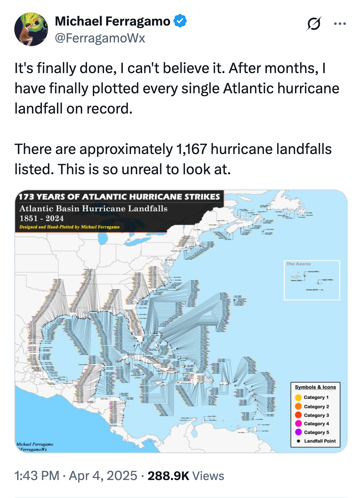
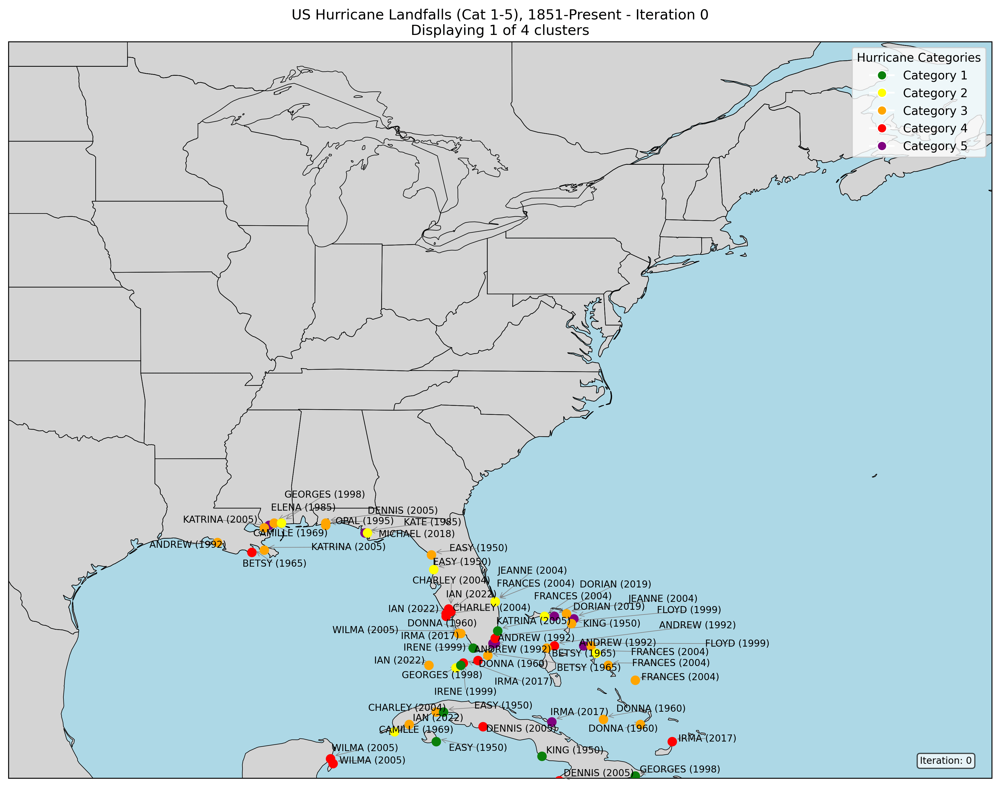
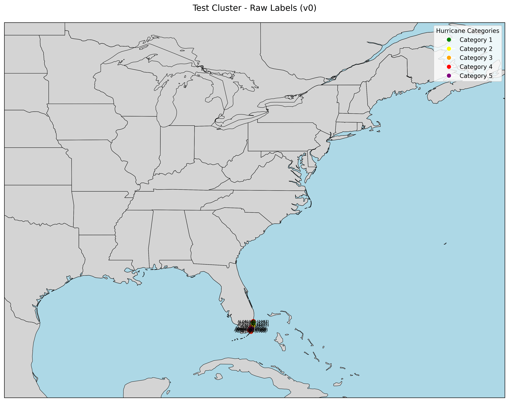
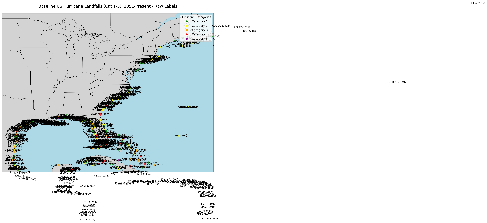

# Hurricane Landfall Map Label Optimization

Follow my progress in this project [here](https://x.com/patelnav/status/1908371085495533707)!

This project aims to reproduce and optimize the label placement for [Michael Ferragamo's visualization](https://x.com/FerragamoWx/status/1908213794314019049) of 1,167 Atlantic hurricane landfalls (1851-2024):

## Progress So Far

### Phase 3: Full-Scale Implementation 🚧
Applied the incremental approach to the full US East Coast map with significant hurricanes. This phase faced challenges with scaling the label placement to handle the increased complexity:

1. **Initial Approach**: Tested sophisticated regional strategies and cluster-based positioning.
2. **Simplified Incremental Approach**: Switched to adding clusters incrementally with adjustText for optimization.
3. **LLM-Guided Point Adjustments**: Had the LLM identify and fix the worst overlapping labels one by one.

Current results show improvement but still struggle with dense hurricane clusters:

### Phase 2: AI-Driven Label Placement ✅
Implemented an agentic loop with Gemini 2.0 Flash Thinking that successfully improved label placement over multiple iterations. The system analyzes overlapping labels in a visualization, generates code changes to fix them, and iteratively improves the layout.

### Phase 1: Visual Analysis with Gemini AI ✅
Tested if Gemini AI could identify label overlaps in a Florida region map with 116 hurricane landfalls. Both Gemini 2.0 Flash Thinking and 2.5 Pro successfully detected and described the overlaps.

### Phase 0: Baseline Map ✅
First attempt at plotting all US hurricane landfalls with raw label placement:

## Project Plan

1. **Phase 0: Baseline Map (Completed)** ✅
   - Parsed HURDAT2 data for hurricane landfalls
   - Created initial visualization with raw labels

2. **Phase 1: Visual Analysis with AI (Completed)** ✅
   - Verified AI can identify label overlaps
   - Confirmed viability of multimodal visual analysis

3. **Phase 2: AI-Driven Label Placement (Completed)** ✅
   - Implemented agent loop framework for iterative improvements
   - Successfully generated 6 iterations of improving label placement
   - Demonstrated LLM's ability to analyze visualizations and generate code changes

4. **Phase 3: Full-Scale Implementation (In Progress)** 🚧
   - Applied to full US coastline with significant hurricanes
   - Tested different strategies for label placement
   - Faced challenges with scaling the point-by-point adjustment approach
   - Next steps: Refine geographic clustering and develop a more systematic approach to label placement

## Lessons Learned & Next Steps

The project has revealed several challenges in scaling LLM-guided data visualization:

1. **Geographic Context Matters**: Breaking down the problem geographically is essential
2. **Incremental Improvement Strategy**: While the point-by-point adjustment works for small datasets, it struggles with larger ones
3. **Balance of Automation and Guidance**: Finding the right level of structure to provide the LLM remains challenging

Future work will focus on developing more specialized geographic regions and providing better initial placement heuristics before LLM refinement.

## Acknowledgments

Special thanks to Michael Ferragamo ([@FerragamoWx](https://x.com/FerragamoWx)) for creating the original visualization that inspired this project. 