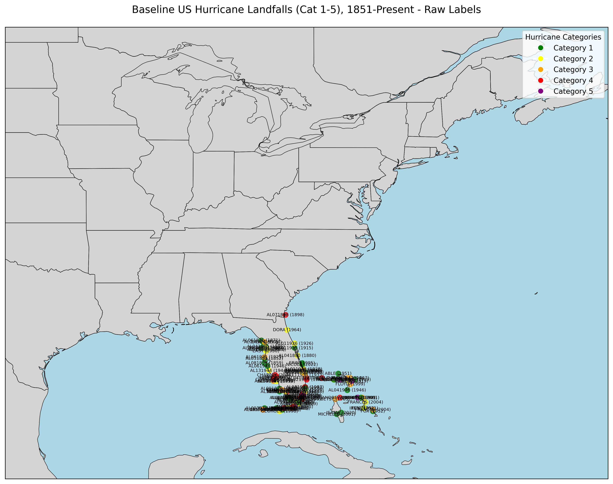

# Hurricane Landfall Map Label Optimization

Follow my progress in this project [here](https://x.com/patelnav/status/1908371085495533707)!

This project aims to reproduce and optimize the label placement for [Michael Ferragamo's visualization](https://x.com/FerragamoWx/status/1908213794314019049) of 1,167 Atlantic hurricane landfalls (1851-2024):

## Progress So Far

### Phase 2: AI-Driven Label Placement 🚧
Development of an agentic loop to iteratively improve label placement...

### Phase 1: Visual Analysis with Gemini AI ✅
Tested if Gemini AI could identify label overlaps in a Florida region map with 116 hurricane landfalls. Both Gemini 2.0 Flash Thinking and 2.5 Pro successfully detected and described the overlaps.

### Phase 0: Baseline Map ✅
First attempt at plotting all US hurricane landfalls with raw label placement:

## Project Plan

1. **Phase 0: Baseline Map (Completed)** ✅
   - Parsed HURDAT2 data for hurricane landfalls
   - Created initial visualization with raw labels

2. **Phase 1: Visual Analysis with AI (Completed)** ✅
   - Verified AI can identify label overlaps
   - Confirmed viability of multimodal visual analysis

3. **Phase 2: AI-Driven Label Placement (In Progress)** 🚧
   - Developing loop framework for iterative improvements
   - Testing AI-generated code diffs

4. **Phase 3: Scaled Implementation** 📅
   - Apply to full US coastline
   - Fine-tune visual aesthetics

## Acknowledgments

Special thanks to Michael Ferragamo ([@FerragamoWx](https://x.com/FerragamoWx)) for creating the original visualization that inspired this project. 